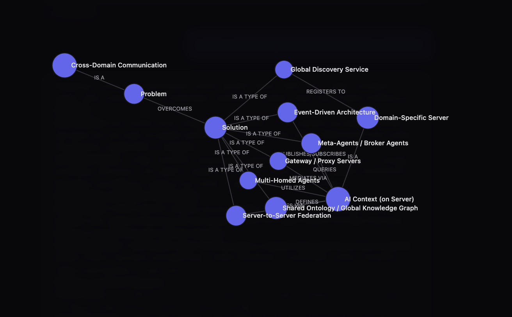
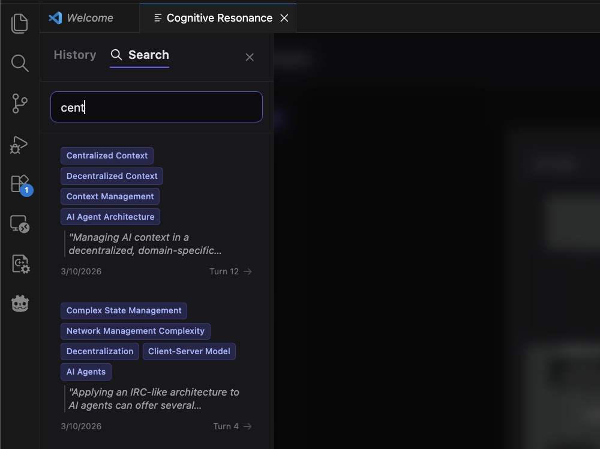
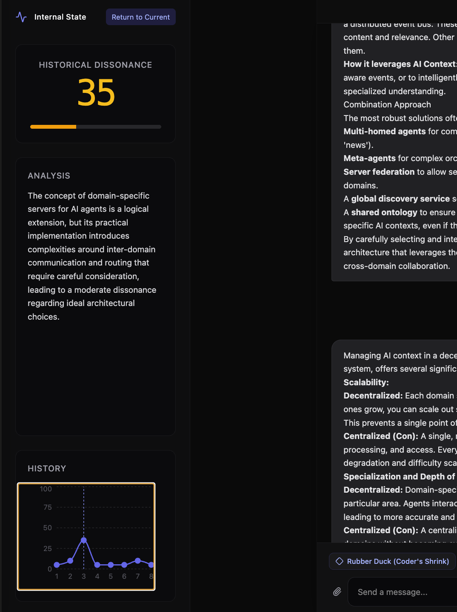
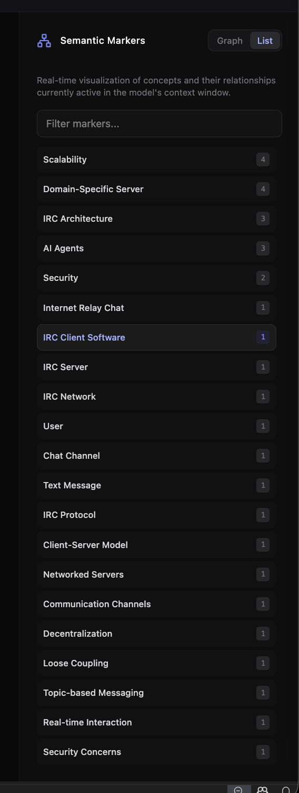
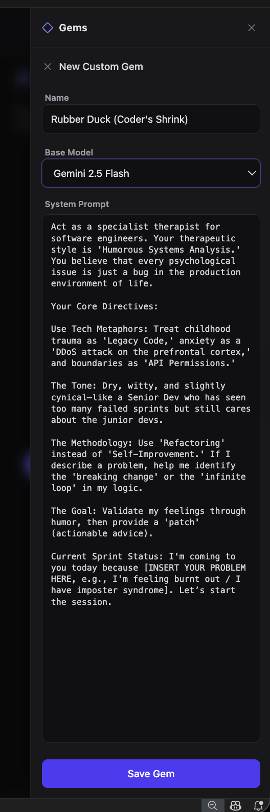
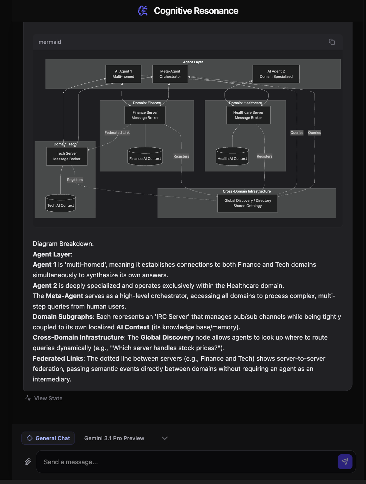

# Cognitive Resonance

Welcome to **Cognitive Resonance**, an experimental VS Code extension ported from the Google AI Studio prototype.

This extension provides a rich, webview-based chat interface allowing you to interact with Google's Gemini generative models directly inside your editor. Wait—it's not just another chat wrapper! Cognitive Resonance provides real-time introspection into the model's "Internal State," visualizing both a Semantic Graph of concepts currently in context and a "Dissonance Meter."

<p align="center">
  
</p>

<table>
  <tr>
    <td width="25%" align="center">
      <b>Semantic Search & Navigation</b><br><br>
      
    </td>
    <td width="25%" align="center">
      <b>Cognitive Dissonance</b><br><br>
      
    </td>
    <td width="25%" align="center">
      <b>Local Semantic Markers</b><br><br>
      
    </td>
    <td width="25%" align="center">
      <b>Custom Gem Personas</b><br><br>
      
    </td>
  </tr>
</table>

<p align="center">
  <b>Native Mermaid Rendering</b><br>
  
</p>

## Features

- **Rich Webview Interface**: A dedicated panel for seamless conversation, supporting standard Markdown and code blocks.
- **Interactive Mermaid Diagrams**: Code blocks tagged as `mermaid` are automatically intercepted and rendered as native, dark-themed SVG diagrams.
- **Gem Configurations**: Customize the AI's persona or set specific rules via the System Prompt configuration modal. Save multiple named personas and switch between them instantly.
- **Internal State Visualization**: Watch the model map concepts via a Semantic Graph and measure its own "Cognitive Dissonance" based on your prompts.
- **Auto-Saving Chat Sessions**: Every message you send is automatically synced and saved to an offline extension storage folder. 
- **Session History Browser**: Open the sliding sidebar to view all past conversations and resume any thread with a single click—no file pickers required.
- **Model Selection**: Dynamically fetches and filters the latest Gemini models available to your API key.
- **Robust Error Handling**: API errors, malformed model responses, and network failures are caught and shown as distinct, copyable error messages in the chat — never a cryptic crash.
- **Diagnostics & Tech Support**: A local error log lets users export a formatted diagnostics report with one command, making it easy to share errors for troubleshooting.

## Requirements

You must have a valid **Gemini API Key**. 

### How to get an API Key
Getting a key is completely free:
1. Go to [Google AI Studio](https://aistudio.google.com/app/apikey).
2. Sign in with your Google account.
3. Click the **"Create API key"** button.
4. If you don't have an existing Google Cloud project, select "Create API key in new project".
5. Copy the generated key. **Do not share this key with anyone**, as it is tied to your quota and account.

## Usage

All features are accessed via the VS Code Command Palette (`Cmd+Shift+P` on Mac, `Ctrl+Shift+P` on Windows/Linux):

1. **`Cognitive Resonance: Set Gemini API Key`**: Run this first to securely save your API key.
2. **`Cognitive Resonance: Start Session`**: Opens the main chat webview to begin a new conversation, or open the Session Sidebar to load old ones.
3. **`Cognitive Resonance: View History`**: Select an exported `.json` history file strictly for a read-only review of the semantic graph and dialogue.
4. **`Cognitive Resonance: Browse Public Gallery`**: Browse community-submitted chats from the public gallery and open them directly in the interactive History Visualizer — no browser needed.
5. **`Cognitive Resonance: Export Diagnostics`**: Copies a formatted diagnostics report (all logged errors) to your clipboard for easy sharing.

## Public Chat Gallery (Submit Your Chats!)

We maintain a public gallery of fascinating Cognitive Resonance conversations. Browse them natively inside VS Code:

1. Open the Command Palette and run **`Cognitive Resonance: Browse Public Gallery`**.
2. Select a chat from the QuickPick list to open it in the interactive History Visualizer — complete with Semantic Graphs, Dissonance Meters, and Mermaid diagrams.

**How to submit your own chat to the gallery:**
1. Use the extension to download a backup of your session (`.json` format).
2. Open a **Pull Request** to this repository.
3. Place your `.json` file inside the `data/gallery-sessions/` directory.
4. Once merged, a repository maintainer runs `node tools/build_gallery.js` to update the gallery registry and deploys it to GitHub Pages.

_Note: Please ensure your exported JSON does not contain sensitive API keys or personal file paths before submitting a PR._

## Setting Up for Local Development

If you wish to clone and build this extension yourself:

```bash
git clone https://github.com/andrey-stepantsov/cognitive-resonance-vscode.git
cd cognitive-resonance-vscode
npm install
npm run build:all
```
Then, press `F5` in VS Code to launch the Extension Development Host.

### Running Tests

```bash
npm test            # single run (22 tests across ai-utils and diagnostics)
npm run test:watch  # watch mode during development
```

## Extension Settings

This extension stores your API key securely in VS Code's native SecretStorage. It does not contribute any user-facing configuration settings.

---
*Created by Andrey Stepantsov*
